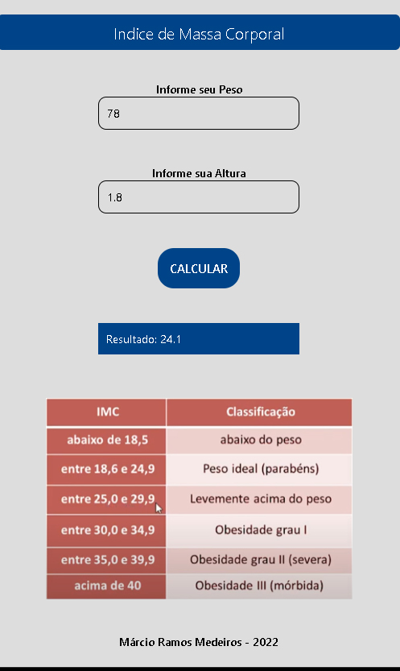

<h1 align="center"> 
  Aplicativo de Cálculo de Indice de massa corporal IMC
</h1>

<h3 align="center">
 O projeto desenvolvido foi um aplicativo de cálculo de indice de massa corporal, que permite saber se o individuo está com o peso ideal, ou fora do peso. O aplicativo foi desenvolvido apenas para praticar e exercitar o uso do React Native.
</h3>

 

### Funcionalidades

- Cálculo do indice de massa corporal. 

 

### Tecnologias 

Esse projeto foi desenvolvido utilizando:

-  [React Native](https://reactnative.dev/);
 

### License
Esse projeto está sob MIT license. Veja [LICENSE](https://github.com/belapferreira/conceitos-react-native/blob/master/LICENSE) para mais informações.

 

<h3 align="center"> Imagem do App </h3> 

 

 

---
<h3 align="center">
 Feito por Márcio Ramos Medeiros - 2022
 </h3>

